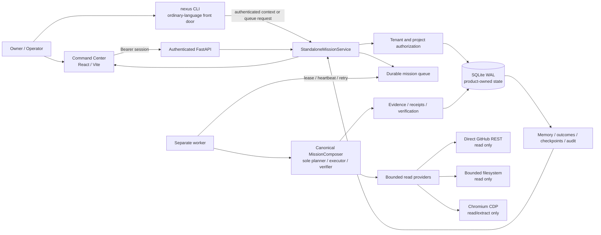

# NEXUS Ascension Architecture

## Boundary legend

| Boundary | Implemented behavior |
|---|---|
| Identity | Product-owned PBKDF2 password verifier, expiring opaque bearer sessions, revocation, tenant and project role checks |
| Execution | Only the durable worker invokes the existing canonical `MissionComposer` |
| Authority | The public capability surface is read-only; unsupported, consequential, or out-of-scope requests fail closed |
| Truth | Mission status, lifecycle, provider state, memory, outcomes, evidence, and UI are derived from persisted API data |
| Persistence | SQLite WAL with backups and guarded restore is implemented for single-host deployment |
| Future extension | PostgreSQL, model providers, schedules, browser interaction, writes, code execution, notifications, and multi-host workers require separate real implementations and verification |
